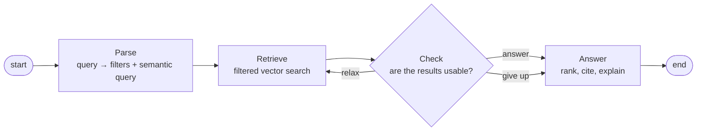

# Scout

[](https://github.com/adriendinzey/Scout/actions/workflows/ci.yml)
[](https://www.python.org/downloads/)
[](LICENSE)

**Agentic search over short-term rental listings — a LangGraph workflow that parses natural language into filters, searches a filter-aware vector index, and loosens its own constraints when results come back thin.**

You type what you actually want:

> *"quiet place near the water for two, under $200 a night, good for working remotely, well reviewed"*

Scout turns that into structured filters plus a semantic query, pushes the filters **into** the vector index, looks at what came back, and — if the results are too thin — decides which single constraint to loosen and searches again. Then it writes a short answer citing the listings and guest reviews it actually used.

> **Status: not started.** This README describes the project being built. Nothing below is claimed as working until its milestone lands and the numbers in [Evaluation](#evaluation) are filled in from a real run. See [docs/ROADMAP.md](docs/ROADMAP.md) for what exists today.

---

## Why this exists

The retrieval step runs on [**Brindle**](https://github.com/adriendinzey/Brindle), a PostgreSQL vector-search extension I wrote that keeps recall high when a SQL predicate has to hold at the same time. Scout is Brindle's real workload: filtered vector search over real listings, not synthetic benchmarks.

That makes the interesting question measurable rather than rhetorical — **does pushing the predicate into the index actually beat filtering after the fact?** Scout answers it against pgvector baselines and exact search, on the same rows, and publishes the losses alongside the wins.

## The agent loop

The Check step is what makes this agentic rather than one long prompt: the agent evaluates its own results and chooses what to do next.



The relaxation is a real decision — the model picks *which* constraint to loosen and says why — but it is fenced by rules the code enforces, not the model:

- at most 3 relaxations per query
- never the same constraint twice in a row
- **never** loosen the group size: a place that cannot fit the party is useless, however well it scores
- out of retries → answer anyway, and say plainly what could not be satisfied

## What it costs to run

Scout calls Claude three times per query at most (Parse, Check, Answer). **You supply your own `ANTHROPIC_API_KEY`** — it is read from the environment and never committed, so running Scout costs the person running it, not the author.

Roughly **$0.005–0.02 per query** depending on how much the loop works, because three things keep it cheap:

| | |
|---|---|
| **Prompt caching** | The Parse grounding block (neighbourhood names, room types, indexed amenities) is byte-identical on every query, so it bills at ~0.1× after the first call |
| **Batch API** | The evaluation harness is asynchronous by nature — nobody is waiting on a hundred eval queries — so it runs at **half price** |
| **A backend switch** | `SCOUT_LLM_BACKEND=fake` runs the whole graph with deterministic canned responses. Development and CI cost nothing; Claude is for runs whose numbers get published |

A Claude Pro/Max subscription does **not** grant API access — that is a separate product. Scout needs API credits.

## Quick start

```bash
# 1. Database: Postgres 17 with Brindle (pinned) and pgvector in one image.
#    The first build compiles Brindle from source and takes a few minutes.
docker compose up -d --wait

# 2. Python environment
uv sync --all-extras
cp .env.example .env      # then add your ANTHROPIC_API_KEY

# 3. Confirm the stack is actually working
uv run scout doctor

# 4. Data — see "Getting the data" below; Scout never downloads it for you.
uv run scout data load
uv run scout data embed
uv run scout data index

# 5. Ask
uv run scout ask "quiet place near the water for two, under \$200, good for working remotely"
```

### Getting the data

Scout uses [Inside Airbnb](https://insideairbnb.com/get-the-data/) listings and reviews for **London**. **You download them yourself, once**, and point `.env` at the local files — nothing in Scout fetches from Inside Airbnb at runtime, by deliberate design. Full instructions, and the privacy rules Scout applies at load time: [docs/DATA.md](docs/DATA.md).

## Evaluation

> Filled in from a single named run once M5 lands. Until then this section is deliberately empty rather than optimistic.

| | |
|---|---|
| City / snapshot | London, _(date TBD)_ |
| Listings indexed | _TBD_ |
| Brindle commit | [`025b131`](https://github.com/adriendinzey/Brindle/commit/025b1315f40a1384695d81ff846bfc8c104c5aea) |
| Embedding model | `all-MiniLM-L6-v2` (384d, normalized) |

**Parse** — per-field filter accuracy, invalid-JSON rate, hallucinated-column rate.
**Retrieval** — recall@10 vs exact search, precision@5 vs hand labels, p50/p95 latency **split cold and warm**, for Brindle / pgvector post-filter / pgvector iterative / exact.
**Agent loop** — share of queries ending with usable results with and without the Check loop, LLM relaxer vs a plain rule-based one, and the tokens and dollars each variant costs.

Method: [docs/EVALUATION.md](docs/EVALUATION.md).

## Limitations

Stated up front rather than discovered by a reader:

- **One city, one snapshot.** Results do not generalize to other markets, and listing IDs are not stable across Inside Airbnb snapshots.
- **Reviews are not searchable.** They are stored for citation and a capped excerpt feeds the listing's embedding, but the unit of search is the listing. A query about something only a reviewer mentioned may miss.
- **`OR` is not pushed down.** Brindle pushes equality and ranges combined with `AND`. Disjunctions run one retrieval per branch and merge, capped at 4 branches, after which Scout post-filters and records that it did.
- **Coordinates are approximate.** Inside Airbnb offsets listing locations for privacy, so "near the water" is a semantic hint and a bounding box, not a real distance.
- **Nulls exclude.** A listing with no rating does not satisfy `rating >= 4.5`. Filtering on quality silently drops new listings, and Scout says so when it does.
- **No availability or pricing intelligence.** Scout cannot answer "is it free in June" — dates are not in scope, and such asks are reported as unsupported rather than quietly ignored.

## Development

Setup, the parallel-worktree workflow, and the daily loop: [docs/DEVELOPMENT.md](docs/DEVELOPMENT.md). Design rationale: [docs/ARCHITECTURE.md](docs/ARCHITECTURE.md). Conventions: [docs/CODING_STANDARDS.md](docs/CODING_STANDARDS.md).

```bash
uv run ruff check . && uv run ruff format --check .
uv run mypy
uv run pytest -m "not integration"    # unit tests, no database needed
uv run pytest                          # everything, needs docker compose up
```

## Attribution and license

Listing and review data from **[Inside Airbnb](http://insideairbnb.com)**, licensed **[CC BY 4.0](https://creativecommons.org/licenses/by/4.0/)**. Inside Airbnb is a mission-driven project reporting on the effect of short-term rentals on housing; Scout is a guest-side search demo and is not affiliated with it. **No Inside Airbnb data is redistributed in this repository** — see [docs/DATA.md](docs/DATA.md).

Scout's own code is [MIT licensed](LICENSE).

Built with AI assistance (Claude Code), the same way [Brindle](https://github.com/adriendinzey/Brindle) was.
