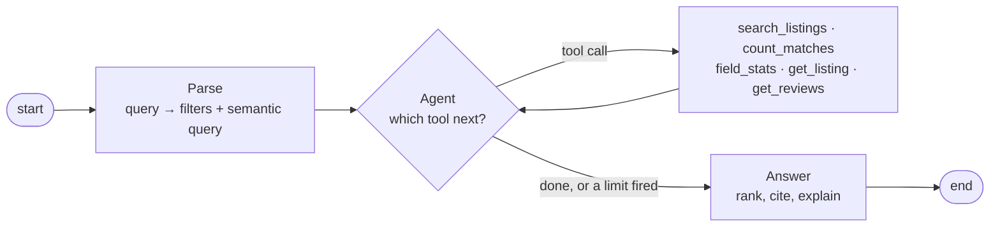

# Scout

[](https://github.com/adriendinzey/Scout/actions/workflows/ci.yml)
[](https://www.python.org/downloads/)
[](LICENSE)

**Agentic search over short-term rental listings — a LangGraph workflow that parses natural language into filters, then lets Claude drive the search itself: counting matches, checking what a field actually looks like, and searching again with different filters when the first attempt comes back thin.**

You type what you actually want:

> *"quiet place near the water for two, under $200 a night, good for working remotely, well reviewed"*

Scout turns that into structured filters plus a semantic query, then hands them to an agent with five tools over a filter-aware vector index. The agent decides what to do: count how many listings match before spending a search, look up the median price in the neighbourhood before moving a price ceiling, search, read a listing, pull its reviews. It works inside limits the code enforces — a tool-call budget, a search budget, a cost ceiling, and a floor on group size it is not allowed to cross. Then it writes a short answer citing the listings and guest reviews it actually used, and says plainly what it could not satisfy.

> **Status: not started.** This README describes the project being built. Nothing below is claimed as working until its milestone lands and the numbers in [Evaluation](#evaluation) are filled in from a real run. See [docs/ROADMAP.md](docs/ROADMAP.md) for what exists today.

---

## Why this exists

The retrieval step runs on [**Brindle**](https://github.com/adriendinzey/Brindle), a PostgreSQL vector-search extension I wrote that keeps recall high when a SQL predicate has to hold at the same time. Scout is Brindle's real workload: filtered vector search over real listings, not synthetic benchmarks.

That makes the interesting question measurable rather than rhetorical — **does pushing the predicate into the index actually beat filtering after the fact?** Scout answers it against pgvector baselines and exact search, on the same rows, and publishes the losses alongside the wins.

## The agent loop

What makes this agentic is not that an LLM is involved — it is that the model chooses the next action and the code decides what is permissible.



Parse stays deterministic on purpose: one grounded, schema-validated call, so the agent starts from validated filters and the expensive grounding block stays cacheable.

**What the model decides:** which tool to call, with which arguments, when to search again with different filters, when it has enough, and how to explain what it changed.

**What the code refuses to let it do:**

| | |
|---|---|
| **10 tool calls** per query, **4 searches** | the loop terminates on a budget, not on the model's goodwill |
| **A group-size floor** | any filter set that lowers the parsed `min_accommodates` is rejected with a structured error — a place that cannot fit the party is useless however well it scores |
| **No repeated calls** | an identical call with identical arguments returns the cached result, and the repeat is recorded |
| **A per-query cost ceiling** | priced from real token counts as the loop runs |
| **A 60-second wall clock** | |
| **An honest ending** | when the loop stops for any reason other than the model finishing, the answer says what could not be satisfied |

Every limit is a pure function with a test that fails if the limit is removed. A limit that lives only in the prompt is a suggestion.

### The baseline it gets measured against

`--mode fixed` keeps the hardcoded path — search, and if fewer than five results come back, loosen the most restrictive filter by rule and search again — so the question "does letting the model choose tools actually beat a hardcoded path?" is answered with numbers rather than vibes. Both modes share the retrieval code, the guardrails and the trace shape; only the decision differs. If `fixed` wins on quality and costs less, this README will say so.

> A sample trace — the agent calling `count_matches`, then searching again with different filters — goes here once M3 lands and there is a real one to paste.

## What it costs to run

Scout calls Claude for Parse (once), for each turn of the agent loop (capped), and for the Answer. **You supply your own `ANTHROPIC_API_KEY`** — it is read from the environment and never committed, so running Scout costs the person running it, not the author.

Every run prints what it cost, and four things keep that number small:

| | |
|---|---|
| **Prompt caching** | The stable prefix — grounding block and tool definitions — is byte-identical on every query, so it bills at ~0.1× after the first call |
| **A per-query ceiling** | `SCOUT_MAX_QUERY_COST_USD` (default $0.10) is checked against real token counts mid-loop; hit it and the agent stops and answers with what it has |
| **Batch API** | The evaluation harness is asynchronous by nature — nobody is waiting on a hundred eval queries — so it runs at **half price** |
| **A backend switch** | `SCOUT_LLM_BACKEND=fake` runs the whole graph, tool loop included, on deterministic canned responses. Development and CI cost nothing; Claude is for runs whose numbers get published |

Per-query cost is **budgeted, not yet measured** — the real figure, per mode, comes from the evaluation run and lands in the table below.

A Claude Pro/Max subscription does **not** grant API access — that is a separate product. Scout needs API credits.

## Quick start

```bash
# 1. Database: Postgres 17 with Brindle (pinned) and pgvector in one image.
#    The first build compiles Brindle from source and takes a few minutes.
docker compose up -d --wait

# 2. Python environment
uv sync --all-extras
cp .env.example .env      # then add your ANTHROPIC_API_KEY

# 3. Confirm the stack is actually working
uv run scout doctor

# 4. Data — see "Getting the data" below; Scout never downloads it for you.
uv run scout data load
uv run scout data embed
uv run scout data index

# 5. Ask
uv run scout ask "quiet place near the water for two, under \$200, good for working remotely"

# ...with the step table: what it called, how long each step took, what it cost
uv run scout ask "3-bed in Hackney under \$60 a night, 5-star" --trace

# ...or against the hardcoded baseline instead of the agent
uv run scout ask "..." --mode fixed

# Earlier runs are stored and replayable
uv run scout runs --last 20
uv run scout trace <run_id>
```

### Getting the data

Scout uses [Inside Airbnb](https://insideairbnb.com/get-the-data/) listings and reviews for **London**. **You download them yourself, once**, and point `.env` at the local files — nothing in Scout fetches from Inside Airbnb at runtime, by deliberate design. Full instructions, and the privacy rules Scout applies at load time: [docs/DATA.md](docs/DATA.md).

## Evaluation

> Filled in from a single named run once M5 lands. Until then this section is deliberately empty rather than optimistic.

| | |
|---|---|
| City / snapshot | London, _(date TBD)_ |
| Listings indexed | _TBD_ |
| Brindle commit | [`025b131`](https://github.com/adriendinzey/Brindle/commit/025b1315f40a1384695d81ff846bfc8c104c5aea) |
| Embedding model | `all-MiniLM-L6-v2` (384d, normalized) |

**Parse** — per-field filter accuracy, invalid-JSON rate, hallucinated-column rate.
**Retrieval** — recall@10 vs exact search, precision@5 vs hand labels, p50/p95 latency **split cold and warm**, for Brindle / pgvector post-filter / pgvector iterative / exact.
**Agent behaviour** — tool calls and searches per query, which tools actually get used, how runs end (finished / limit / timeout / error), invalid-argument rate, repeat rate.
**Agent vs fixed** — the same eval set in `--mode agent`, `--mode fixed`, and `--mode fixed --no-relax`: share of queries ending with ≥ 5 results, precision@5, latency, tokens, and **dollars per query**.

Method: [docs/EVALUATION.md](docs/EVALUATION.md).

## Limitations

Stated up front rather than discovered by a reader:

- **One city, one snapshot.** Results do not generalize to other markets, and listing IDs are not stable across Inside Airbnb snapshots.
- **Reviews are not searchable.** They are stored for citation and a capped excerpt feeds the listing's embedding, but the unit of search is the listing. A query about something only a reviewer mentioned may miss.
- **`OR` is not pushed down.** Brindle pushes equality and ranges combined with `AND`. Disjunctions run one retrieval per branch and merge, capped at 4 branches, after which Scout post-filters and records that it did.
- **Coordinates are approximate.** Inside Airbnb offsets listing locations for privacy, so "near the water" is a semantic hint and a bounding box, not a real distance.
- **Nulls exclude.** A listing with no rating does not satisfy `rating >= 4.5`. Filtering on quality silently drops new listings, and Scout says so when it does.
- **No availability or pricing intelligence.** Scout cannot answer "is it free in June" — dates are not in scope, and such asks are reported as unsupported rather than quietly ignored.

## Development

Setup, the parallel-worktree workflow, and the daily loop: [docs/DEVELOPMENT.md](docs/DEVELOPMENT.md). Design rationale: [docs/ARCHITECTURE.md](docs/ARCHITECTURE.md). Conventions: [docs/CODING_STANDARDS.md](docs/CODING_STANDARDS.md).

```bash
uv run ruff check . && uv run ruff format --check .
uv run mypy
uv run pytest -m "not integration"    # unit tests, no database needed
uv run pytest                          # everything, needs docker compose up
```

## Attribution and license

Listing and review data from **[Inside Airbnb](http://insideairbnb.com)**, licensed **[CC BY 4.0](https://creativecommons.org/licenses/by/4.0/)**. Inside Airbnb is a mission-driven project reporting on the effect of short-term rentals on housing; Scout is a guest-side search demo and is not affiliated with it. **No Inside Airbnb data is redistributed in this repository** — see [docs/DATA.md](docs/DATA.md).

Scout's own code is [MIT licensed](LICENSE).

Built with AI assistance (Claude Code), the same way [Brindle](https://github.com/adriendinzey/Brindle) was.
