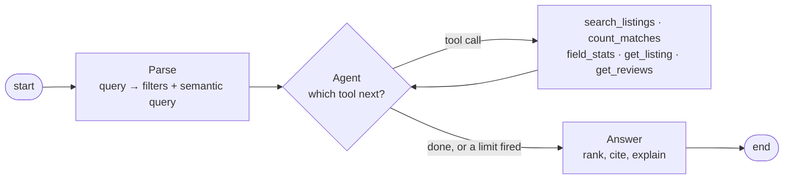

# Scout

[](https://github.com/adriendinzey/Scout/actions/workflows/ci.yml)
[](https://www.python.org/downloads/)
[](LICENSE)

Agentic search over short-term rental listings, built as a LangGraph workflow. Scout parses a natural-language query into structured filters, and then lets Claude drive the search itself by counting matches, checking what a field contains, and searching again with different filters when the first attempt comes back thin.

A query looks like this:

> *"quiet place near the water for two, under £200 a night, good for working remotely, well reviewed"*

Scout turns that into structured filters plus a semantic query, and hands both to an agent with five tools over a filter-aware vector index. The agent chooses what to do next. It can count how many listings match before spending a search, look up the median price in a neighbourhood before moving a price ceiling, search, read a listing, or pull its reviews. The design constrains the agent in code rather than in the prompt, through a tool-call budget, a search budget, a cost ceiling, and a floor on group size that it cannot cross. It then writes a short answer that cites the listings and guest reviews it used, and states what it could not satisfy.

> **Status: the data loads, but the demo does not run yet.** `scout ask` is not implemented. The embedder, the index build, the Parse node, the Retrieve node and the agent loop are the next milestones. The [What works today](#what-works-today) section lists everything that is built. Nothing else in this README is claimed as working, and the [Evaluation](#evaluation) section stays empty until the numbers come from a real run. Milestones are tracked in [docs/ROADMAP.md](docs/ROADMAP.md).

---

## What works today

This is the state of `main` on 2026-10-01. Anything that is not ticked here is a design note, not a claim.

| Component | State | Asserted by |
|---|---|---|
| Postgres 17 in one image with [Brindle](https://github.com/adriendinzey/Brindle) (pinned `025b1315`) and pgvector 0.8.0, plus `scout doctor` to confirm it | ✅ | `docker compose up -d --wait` and `uv run scout doctor`. This is a recorded run and not a test, because nothing in `tests/` drives the CLI |
| Filter pushdown, the premise of the whole project. `EXPLAIN` shows `Index Cond` rather than a post-scan `Filter` for every supported predicate shape, `ef_search` bounds a ranked scan, and NULL satisfies no comparison | ✅ | `tests/integration/test_brindle_pushdown.py` |
| The schema, the lookup tables, and the migration runner. `scout data migrate` applies migrations `0001` and `0002` | ✅ | `tests/integration/test_schema.py`, `tests/unit/test_migrate.py` |
| `scout data load`, which streams both CSVs into PostgreSQL. It drops host and reviewer identity during parsing into rows that have no field to hold it, caps the reviews kept per listing, replaces rather than duplicates on a reload, and refuses to run unless it is given the snapshot's release date | ✅ The London `2026-06-19` snapshot loads to 92,633 listings and 291,004 reviews, and `doc_text` and `embedding` are still NULL on every row | `tests/unit/test_load.py`, `tests/unit/test_parsers.py`, `tests/integration/test_load.py` |
| Typed settings, including the validator that refuses a candidate pool larger than `ef_search`, together with cost accounting that covers prompt-cache and Batch rates | ✅ | `tests/unit/test_config.py`, `tests/unit/test_pricing.py` |
| The `Filters` model and the filter-to-SQL mapping. It composes parameterized filtered-vector queries, fans out disjunctions up to a cap, and reports both the post-filters it fell back to and the filters that exclude NULLs | ✅ This is pure logic that nothing calls yet | `tests/unit/test_filters_to_sql.py` |
| The LLM boundary. It holds the backend protocol, the Anthropic client with its cacheable prefix, a deterministic fake that can script a whole tool-use conversation, and per-run token and dollar totals held in memory | ✅ | `tests/unit/test_backend.py`, `test_fake_backend.py`, `test_anthropic_backend.py`, `test_usage.py` |
| The amenity columns, the document template, `scout data embed`, and `scout data index` | ⬜ M1 | Nothing yet |
| The LangGraph wiring, the Parse node, the Retrieve node, and `scout ask` | ⬜ M2 | Nothing yet |
| The agent tool loop, the five tools, the enforced budgets, and `--mode fixed` | ⬜ M3 | Nothing yet |
| The run store, `scout trace`, `scout runs`, and the per-run cost that gets persisted and printed | ⬜ M3.5 | Nothing yet |
| Ranking, review citations, and the Answer node | ⬜ M4 | Nothing yet |
| The evaluation harness, and every number in the [Evaluation](#evaluation) section | ⬜ M5 | Nothing yet |

482 tests pass in total, made up of 432 unit tests and 50 integration tests against the Compose database. Both `ruff` and `mypy --strict` are clean. The commands that are not implemented exit non-zero and name the milestone they land in, rather than printing nothing and returning 0.

## Why this exists

The retrieval step runs on [Brindle](https://github.com/adriendinzey/Brindle), a PostgreSQL vector-search extension I wrote to keep recall high when a SQL predicate has to hold at the same time. Scout is Brindle's real workload. That means filtered vector search over real listings instead of over synthetic benchmarks.

That makes the central question measurable. Does pushing the predicate into the index actually beat filtering after the fact? Scout answers that against pgvector baselines and exact search, on the same rows, and publishes the losses alongside the wins.

## The agent loop

> **This section describes the design for M3, and none of it is implemented yet.** The budgets below currently exist only as validated settings that `scout doctor` prints. The loop that enforces them, and the tools it calls, come after Parse and Retrieve.

What makes this agentic is not that an LLM is involved, but that the model chooses the next action while the code decides what is permissible.


```mermaid
flowchart LR
    START([start]) --> parse[Parse<br/>query → filters + semantic query]
    parse --> agent{Agent<br/>which tool next?}
    agent -->|tool call| tools[search_listings · count_matches<br/>field_stats · get_listing · get_reviews]
    tools --> agent
    agent -->|done, or a limit fired| answer[Answer<br/>rank, cite, explain]
    answer --> END([end])
```

Parse stays deterministic by design. It makes one grounded, schema-validated call, so that the agent starts from validated filters and the expensive grounding block stays cacheable.

The graph is a LangGraph `StateGraph` with named nodes and visible edges, and the tool loop inside the agent node is written out by hand. There is no `create_react_agent` and no other prebuilt agent helper anywhere in the project. The control flow and the budgets are the part of this worth showing, and a prebuilt agent would hide both.

The model decides which tool to call, with which arguments, when to search again with different filters, when it has enough, and how to explain what it changed.

The code decides what the model is allowed to do:

| Limit | Behaviour |
|---|---|
| 10 tool calls per query, and 4 searches | The loop terminates once a budget is exhausted, whether or not the model is finished |
| A floor on group size | Any filter set that lowers the parsed `min_accommodates` is rejected with a structured error, because a listing that cannot fit the party is not a useful result |
| No repeated calls | An identical call with identical arguments returns the cached result, and the repeat is recorded |
| A per-query cost ceiling | The cost is priced from the token counts the API reports while the loop runs |
| A 60-second wall clock | The run ends when the clock expires, and the answer says that it did |
| A stated ending | Whenever the loop stops for any reason other than the model finishing, the answer says what could not be satisfied |

Each of these limits will be implemented as a pure function with a test that fails if the limit is removed. A limit that lives only in the prompt is a suggestion, so M3 is not complete until those tests exist.

### The baseline, `--mode fixed`

`--mode fixed` is the hardcoded path. It searches, and if fewer than five results come back it loosens the most restrictive filter by rule and searches again. It exists so that the question of whether letting the model choose tools beats a hardcoded path can be answered with measurements instead of argument. Both modes share the retrieval code, the guardrails and the trace shape, so the only thing that differs between them is the decision. If `fixed` wins on quality and costs less, then this README will say so.

A sample trace, showing the agent calling `count_matches` and then searching again with different filters, goes here once M3 lands and there is a real one to paste.

## What it costs to run

Scout will call Claude for Parse once per query, then for each turn of the agent loop up to the cap, and then for the Answer. No node calls Claude yet, and the only code that can reach the API is the boundary in `src/scout/llm/`. You supply your own `ANTHROPIC_API_KEY`, which is read from the environment and never committed, so running Scout costs whoever runs it rather than the author.

Four measures keep that cost down, and two of them are already implemented:

| Measure | State | Detail |
|---|---|---|
| Prompt caching | ✅ | The stable prefix is the grounding block together with the tool definitions, and it is byte-identical on every query, so it bills at roughly 0.1× after the first call. The cache breakpoint is set at the boundary, and cache reads and writes are counted and priced |
| A per-query ceiling | ⬜ M3 | `SCOUT_MAX_QUERY_COST_USD` defaults to $0.10 and is validated configuration today. The mid-loop check that stops the agent and answers with what it already has arrives with the loop itself |
| The Batch API | ⬜ M5 | The half-price rates are in the cost model already, but the evaluation harness that submits the batches is still to come |
| A backend switch | ✅ | `SCOUT_LLM_BACKEND=fake` is the default, and it returns scripted tool-use conversations without touching the network, so development and CI cost nothing. The unit suite also blocks socket access, so no test can reach the real API |

Per-query cost is budgeted but not yet measured. The real figure for each mode comes from the evaluation run.

A Claude Pro or Max subscription does not grant API access, because that is a separate product. Scout needs API credits.

## Quick start

These steps work today:

```bash
# 1. Database: Postgres 17 with Brindle (pinned) and pgvector in one image.
#    The first build compiles Brindle from source and takes a few minutes.
docker compose up -d --wait

# 2. Python environment. Adding --all-extras pulls in torch for the embedder,
#    but the embedder is not built yet, so you do not need it here.
uv sync
cp .env.example .env      # This ships SCOUT_LLM_BACKEND=fake and an empty key,
                          # so a fresh copy cannot spend money.

# 3. Check the database, the extensions, and the configuration.
uv run scout doctor

# 4. Create the schema.
uv run scout data migrate

# 5. Load the snapshot. See "Getting the data" below, because Scout does not
#    download it for you. SCOUT_SNAPSHOT_DATE is required, since listing ids
#    are not stable between releases.
uv run scout data load

# 6. Run the tests. The integration tests need the database from step 1.
uv run pytest
```

The remaining commands are specified but not implemented. Each one exits non-zero and names the milestone it lands in:

```bash
uv run scout data embed    # M1
uv run scout data index    # M1

# `ask` lands in M2, and it reports that whichever flags you pass. The flags
# below start taking effect in the milestone noted beside each one.
uv run scout ask "quiet place near the water for two, under £200, good for working remotely"
uv run scout ask "3-bed in Hackney under £60 a night, 5-star" --trace   # step table: M3.5
uv run scout ask "..." --mode fixed                                     # the baseline: M3

# Stored runs. These become replayable in M3.5.
uv run scout runs --last 20
uv run scout trace <run_id>
```

### Getting the data

Scout uses [Inside Airbnb](https://insideairbnb.com/get-the-data/) listings and reviews for London. You download them yourself, once, and then point `.env` at the local files. Nothing in Scout fetches from Inside Airbnb at runtime, and that is deliberate. Full instructions, along with the privacy rules Scout applies at load time, are in [docs/DATA.md](docs/DATA.md).

## Evaluation

> This section gets filled in from a single named run once M5 lands, and it stays empty until then.

| Item | Value |
|---|---|
| City and snapshot | London, _(date TBD)_ |
| Listings indexed | _TBD_ |
| Brindle commit | [`025b131`](https://github.com/adriendinzey/Brindle/commit/025b1315f40a1384695d81ff846bfc8c104c5aea) |
| Embedding model | `all-MiniLM-L6-v2` (384d, normalized) |

The report will cover four groups of metrics.

- **Parse.** Per-field filter accuracy, the invalid-JSON rate, and the hallucinated-column rate.
- **Retrieval.** Recall@10 against exact search, precision@5 against hand labels, and p50 and p95 latency reported separately for cold and warm connections. Each is measured for Brindle, for pgvector with a post-filter, for pgvector with an iterative scan, and for exact search.
- **Agent behaviour.** Tool calls and searches per query, which tools actually get used, how runs end as one of finished, limit, timeout or error, the invalid-argument rate, and the repeat rate.
- **Agent against fixed.** The same eval set run in `--mode agent`, in `--mode fixed`, and in `--mode fixed --no-relax`, comparing the share of queries that end with at least five results, precision@5, latency, tokens, and dollars per query.

The method is written up in [docs/EVALUATION.md](docs/EVALUATION.md).

## Limitations

These are known limits of the design. The ones that describe what Scout reports back depend on the Answer node, so they arrive in M4.

- **One city, one snapshot.** The results do not generalize to other markets, and listing IDs are not stable across Inside Airbnb snapshots.
- **Reviews are not searchable.** They are stored so that they can be cited, and a capped excerpt feeds the listing's embedding, but the unit of search is the listing. A query about something that only a reviewer mentioned may miss.
- **`OR` is not pushed down.** Brindle pushes equality and ranges that are combined with `AND`. Disjunctions run one retrieval per branch and then merge, up to a cap of 4 branches. Past that cap Scout post-filters instead, and records that it did.
- **Coordinates are approximate.** Inside Airbnb offsets listing locations for privacy, so "near the water" is a semantic hint and a bounding box instead of a real distance.
- **Nulls exclude.** A listing with no rating does not satisfy `rating >= 4.5`, so filtering on quality quietly drops new listings. The query plan reports which filters exclude NULLs, and the answer is expected to state that it happened.
- **No availability or pricing intelligence.** Scout cannot answer a question like "is it free in June". Dates are out of scope, and requests like that are to be reported as unsupported instead of being quietly ignored.

## Development

Setup, the parallel-worktree workflow, and the daily loop are documented in [docs/DEVELOPMENT.md](docs/DEVELOPMENT.md). The design rationale is in [docs/ARCHITECTURE.md](docs/ARCHITECTURE.md), and the conventions are in [docs/CODING_STANDARDS.md](docs/CODING_STANDARDS.md).

```bash
uv run ruff check . && uv run ruff format --check .
uv run mypy
uv run pytest -m "not integration"    # unit tests, no database needed
uv run pytest                          # everything, needs docker compose up
```

## Attribution and license

The listing and review data comes from [Inside Airbnb](http://insideairbnb.com) and is licensed under [CC BY 4.0](https://creativecommons.org/licenses/by/4.0/). Inside Airbnb is a mission-driven project that reports on the effect of short-term rentals on housing, whereas Scout is a guest-side search demo and is not affiliated with it. No Inside Airbnb data is redistributed in this repository. See [docs/DATA.md](docs/DATA.md) for the details.

Scout's own code is [MIT licensed](LICENSE).

Built with AI assistance (Claude Code), as [Brindle](https://github.com/adriendinzey/Brindle) was.
